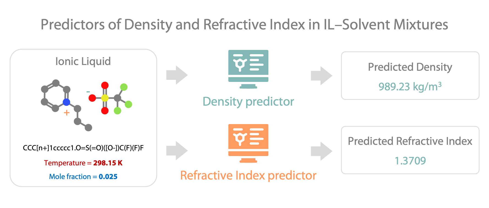

# QSPR Modeling of Density and Refractive Index for IL–Solvent Mixtures



This repository contains QSPR models for predicting the density (kg/m<sup>3</sup>) and refractive index (Na D-line) of binary mixtures of ionic liquids (ILs) with water, ethanol, and isopropanol under near-atmospheric pressure conditions (90–110 kPa), at user-specified IL mole fractions and temperatures.

## Background

Ionic liquids (ILs) are tunable organic salts with negligible vapor pressure, high thermal stability, and strong solvating ability, and their vast combinatorial chemical space enables the design of systems with diverse physicochemical properties. Accurate knowledge of key properties such as density and refractive index is essential for rational design of IL–solvent systems, yet experimental measurements are often laborious and costly. This project develops data-driven QSPR models to estimate density and refractive index across varying compositions and temperatures.

## Repository Structure

- `datasets/` – Curated training and external test sets
- `models/` – Trained models
- `figures/` - Contains the README figure

## Datasets and Models

Training datasets were extracted from the [ILThermo database](https://ilthermo.boulder.nist.gov/) using a specifically developed tool, [pyIonics](https://github.com/kammmran/pyionics). The external test set was provided by the [Institute of Petrochemical Processes](https://nkpi.az/?lang=en) (Baku, Azerbaijan).

The curation procedure included duplicate removal, consistency checks, and standardization of molecular structures and composition variables.

Molecular structures were represented using 2D descriptors calculated with the [Mordred descriptor package](https://github.com/mordred-descriptor/mordred). For each IL, descriptors were computed separately for the cation and anion and then averaged to obtain a unified IL representation. Low-variance and near-constant descriptors were removed, highly correlated features were grouped, and thermodynamic variables (temperature and IL mole fraction) were appended to form the final feature set.

Model development was based on five independently shuffled variants of each curated dataset. For each variant, 5-fold cross-validation with group-based splitting (ensuring that identical IL SMILES did not appear in both training and validation folds) was used for hyperparameter optimization of XGBoost models. The best configuration from each run was retained, and the final predictive system consists of an ensemble of five independently trained XGBoost models whose predictions are combined in a consensus manner.

### Model Performance

| Property | System | 5-CV RMSE | 5-CV R<sup>2</sup> |
|----------|--------|-----------|----------|
| Density  | Pure IL        | 33.19 | 0.96 |
| Density  | IL–Water        | 32.42 | 0.92 |
| Density  | IL–Ethanol      | 51.73 | 0.9 |
| Density  | IL–Isopropanol  | 38.03 | 0.94 |
| Refractive Index | Pure IL       | 0.01 | 0.93 |
| Refractive Index | IL–Water       | 0.01 | 0.93 |
| Refractive Index | IL–Ethanol     | 0.01 | 0.93 |
| Refractive Index | IL–Isopropanol | 0.01 | 0.9 |

## Installation

### Requirements

- Python 3.11 or higher  
- Dependencies listed in `requirements.txt`

### 1. Clone the repository:

```bash
git clone https://github.com/sbaybekov/qspr-il-density-refractive-index.git
cd qspr-il-density-refractive-index
```

### 2. Create and activate a virtual environment

#### Option 1 - Using `venv`:
Create environment:
```bash
python -m venv ilqspr
```
Activate it:
- macOS / Linux
```bash
source ilqspr/bin/activate  # macOS/Linux
```
- Windows (PowerShell)
```bash
ilqspr\Scripts\Activate.ps1
```
- Windows (Command Prompt)
```bash
ilqspr\Scripts\activate
```

Install dependencies:
```bash
pip install -r requirements.txt
```

#### Option 2 - Using `conda`:
Create environment:
```bash
conda create -n ilqspr python=3.11
```
Activate it:
```bash
conda activate ilqspr
```

Install dependencies:
```bash
pip install -r requirements.txt
```

## Usage

After installation, predictions can be generated using the provided application scripts.

### Input File Format

Prepare a comma-separated CSV file containing the following information:

- **IL SMILES** (structure of the ionic liquid)
- **Mole fraction of IL** in the mixture
- **Temperature** (if required by the model)

Example:

| IL_SMILES              | Mole_fraction_IL | Temperature |
|------------------------|------------------|-------------|
| C\[N+](C)(C)C.\[Cl-]     | 0.30             | 298.15      |

Column names can be customized via command-line arguments. 
The default expected names for the columns are `SMILES`, `Mole_fraction`, `Temperature`, respectively.

---

### Application of a model (example)

Run the following command:

```bash
python models/ri_ethanol/apply_ri_ethanol.py \
    --input_csv datasets/external_test_set.csv \
    --smiles_col IL_SMILES \
    --mole_fraction_col Mole_fraction_IL \
    --output_csv predictions_ri_ethanol.csv
```

⸻

Required Argument

`--input_csv INPUT_CSV`
Path to the input CSV file (comma-delimited).

⸻

Optional Arguments

`--smiles_col SMILES_COL`
Name of the SMILES column in the input CSV.
Default: `SMILES`

`--mole_fraction_col MOLE_FRACTION_COL`
Name of the mole fraction column.
Default: `Mole_fraction`

`--temp_col TEMP_COL`
Name of the temperature column.
Default: `Temperature`

`--model_dir MODEL_DIR`
Directory containing the trained ensemble model and metadata.
Default: `RI_ethanol_ensemble_model`

`--output_csv OUTPUT_CSV`
Path to save the output CSV with predictions.
Default: `predictions.csv`

### Help Messages

All scripts support a help message detailing the available command-line arguments. To view it, run:

```bash
python apply_ri_ethanol.py --help
```

The help message of each model is also available in `code_help_message.txt` in the same directory where the model is.

## Citation

If you use this work, please cite:

`Manuscript in preparation`