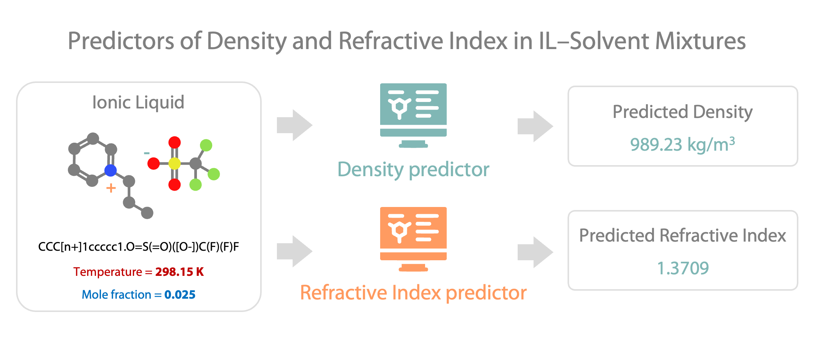

# QSPR Modeling of Ionic Liquid properties



This repository contains QSPR models for predicting the density (kg/m<sup>3</sup>) and refractive index (Na D-line) of binary mixtures of ionic liquids (ILs) with water, ethanol, and isopropanol under near-atmospheric pressure conditions (90–110 kPa), at user-specified IL mole fractions and temperatures.

**Live app:** https://qspr-il-density-refractive-index.streamlit.app/

## Authors

- [Shamkhal Baybekov](https://github.com/sbaybekov) – [LinkedIn](https://www.linkedin.com/in/shamkhal-baybekov/)
- [Kamran Heydarov](https://github.com/kammmran) – [LinkedIn](https://www.linkedin.com/in/kamranheydarov/)

## Background

Ionic liquids (ILs) are tunable organic salts with negligible vapor pressure, high thermal stability, and strong solvating ability, and their vast combinatorial chemical space enables the design of systems with diverse physicochemical properties. Accurate knowledge of key properties such as density and refractive index is essential for rational design of IL–solvent systems, yet experimental measurements are often laborious and costly. This project develops data-driven QSPR models to estimate density and refractive index across varying compositions and temperatures.

## Repository Structure

- `qspr_il/` – The installable package: the prediction engine and model registry (`qspr_il/models/`, `qspr_il/registry.py`), the ILThermo data fetch/cleaning pipeline (`qspr_il/data/`), the CLI (`qspr_il/cli.py`), and the Streamlit app (`qspr_il/app.py`)
- `datasets/` – Curated training sets and an external test set
- `figures/` - Contains the README figure
- `results/` - Contains generated prediction files and interactive UMAP visualizations (`results/interactive_umap/`) comparing the training data to the external test set for each model
- `tests/` - Pytest suite
- `docs/` - Sphinx documentation (built via autodoc against `qspr_il`)

## Datasets and Models

Training datasets are sourced from the [ILThermo database](https://ilthermo.boulder.nist.gov/). Data acquisition used to depend on an external tool, [pyIonics](https://github.com/kammmran/pyionics); that tool is now vendored permanently inside `qspr_il.data.ionics` (pyIonics itself is being deprecated as a standalone package). The "duplicate removal, consistency checks, and standardization" step is implemented in `qspr_il.data.cleaning` — see the [data pipeline docs](docs/data_pipeline.rst) for details, including known limitations of the underlying data source, and for how to regenerate a curated dataset yourself.

This pipeline isn't limited to density and refractive index — any of the ~55 properties ILThermo tracks (viscosity, surface tension, thermal conductivity, and more) can be fetched and cleaned over any temperature/pressure range you choose. Both `python qspr.py` and the Streamlit app ask up front whether you want to run a prediction model, fetch & clean data, or both (fetch data, then immediately run the matching trained model on it if one exists for that property).

Molecular structures were represented using 2D descriptors calculated with the [Mordred descriptor package](https://github.com/mordred-descriptor/mordred). For each IL, descriptors were computed separately for the cation and anion and then averaged to obtain a unified IL representation. Low-variance and near-constant descriptors were removed, highly correlated features were grouped, and thermodynamic variables (temperature and IL mole fraction) were appended to form the final feature set.

Model development was based on five independently shuffled variants of each curated dataset. For each variant, 5-fold cross-validation with group-based splitting (ensuring that identical IL SMILES did not appear in both training and validation folds) was used for hyperparameter optimization of XGBoost models. The best configuration from each run was retained, and the final predictive system consists of an ensemble of five independently trained XGBoost models whose predictions are combined in a consensus manner.

### Model Performance

| Property | System | 5-CV RMSE | 5-CV R<sup>2</sup> |
|----------|--------|-----------|----------|
| Density  | Pure IL        | 33.19 | 0.96 |
| Density  | IL–Water        | 32.42 | 0.92 |
| Density  | IL–Ethanol      | 51.73 | 0.9 |
| Density  | IL–Isopropanol  | 38.03 | 0.94 |
| Refractive Index | Pure IL       | 0.01 | 0.93 |
| Refractive Index | IL–Water       | 0.01 | 0.93 |
| Refractive Index | IL–Ethanol     | 0.01 | 0.93 |
| Refractive Index | IL–Isopropanol | 0.01 | 0.9 |

## Installation

### Requirements

- Python 3.11 or higher

### 1. Clone the repository:

```bash
git clone https://github.com/sbaybekov/qspr-il-density-refractive-index.git
cd qspr-il-density-refractive-index
```

### 2. Create a virtual environment and install the package

Using Python `venv`:

```bash
python3 -m venv .venv
source .venv/bin/activate
python -m pip install --upgrade pip
python -m pip install -e ".[gui,dev,docs]"
```

This one command (verified against a clean environment) installs `qspr_il`
itself in editable mode plus everything needed to predict, run the Streamlit
app (`gui`), run the tests (`dev`), and build the docs (`docs`). Drop extras
you don't need, e.g. `pip install -e .` alone for just the core prediction
pipeline and data fetch/clean tools, or `pip install -e ".[gui]"` to add the
Streamlit app.

Alternatively, `requirements.txt` pins the same set of dependencies as one
flat list (`python -m pip install -r requirements.txt && python -m pip install -e .`)
if you prefer that over extras.

Using `conda`:
Create environment:
```bash
conda create -n qspr_il python=3.11.5
```
Activate it:
```bash
conda activate qspr_il
```

Install dependencies:
```bash
conda install xgboost=2.1.4
python -m pip install -e ".[gui,dev,docs]"
```

Either way, `pip install -e .` is what makes `import qspr_il` and the
`qspr-il-predict` console-script command work -- it's not optional, unlike
the bracketed extras.

## Usage

After installation, predictions can be generated using the provided application scripts.

### Build the Sphinx documentation

Install the dependencies, then build the HTML documentation from the project root:

```bash
python -m sphinx -b html docs docs/_build/html
```

Open `docs/_build/html/index.html` in a browser to view the generated documentation.

### Input File Format

Prepare a comma-separated CSV file containing the following information:

- **IL SMILES** (structure of the ionic liquid)
- **Mole fraction of IL** in the mixture
- **Temperature** (if required by the model)

Example:

| IL_SMILES              | Mole_fraction_IL | Temperature |
|------------------------|------------------|-------------|
| C\[N+](C)(C)C.\[Cl-]     | 0.30             | 298.15      |

Column names can be customized via command-line arguments (or, in the Streamlit app, the column-name fields).
The bundled external test set uses `IL_SMILES` and `Mole_fraction_IL`. The default mole-fraction column name (`Mole_fraction_IL`) already matches it; the default SMILES column name is generic (`SMILES`), so pass `--smiles_col IL_SMILES` (CLI) or set the SMILES column field to `IL_SMILES` (app) when using the bundled test set as-is.

### Interactive settings

For one launcher covering all available models, run:

```bash
python qspr.py
```

It first asks what you want to do: run a prediction model, fetch & clean ILThermo data (for any property, not just density/refractive index), or both. Choosing to run a model asks you to choose density or refractive index and the solvent, then asks for the input and output settings. The default output is saved in `results/` with the selected model name, for example `results/ri_ethanol_prediction.csv`. Passing `--model` on the command line skips the initial prompt and goes straight to prediction.

You can also run `python qspr.py` without any flags to enter every setting interactively, including which of the 8 models to run. Press **Enter** at any optional setting to keep its default. Leave the temperature column empty to use `298.15 K` for every row.

---

### Application of a model (example)

Run the following command:

```bash
python qspr.py --model 1 --input_csv datasets/external_test_set.csv --smiles_col IL_SMILES --mole_fraction_col Mole_fraction_IL --output_csv results/ri_ethanol_prediction.csv
```

⸻

`--model {1..8}`
Which of the 8 trained models to run (see the table above; interactively prompted if omitted).

`--input_csv INPUT_CSV`
Path to the input CSV file (comma-delimited).

⸻

Optional Arguments

`--smiles_col SMILES_COL`
Name of the SMILES column in the input CSV.
Default: `SMILES`

`--mole_fraction_col MOLE_FRACTION_COL`
Name of the mole fraction column (mixture models only; not used for pure-IL models).
Default: `Mole_fraction_IL` (matches the bundled `datasets/external_test_set.csv`)

`--temp_col TEMP_COL`
Name of the temperature column.
Default: `Temperature`. 
If not indicated, it will take 298.15 K as a default value.

`--model_dir MODEL_DIR`
Directory containing the trained ensemble model and metadata. Defaults to the selected model's bundled directory under `qspr_il/models/`.

`--output_csv OUTPUT_CSV`
Path to save the output CSV with predictions.
Default: `results/<model_name>_prediction.csv`

### Help Messages

The CLI supports a help message detailing the available command-line arguments:

```bash
python qspr.py --help
```

### Streamlit GUI

A Streamlit app provides a graphical alternative to the CLI. A hosted instance
is available at
[qspr-il-density-refractive-index.streamlit.app](https://qspr-il-density-refractive-index.streamlit.app/),
or run it locally:

```bash
python -m pip install -e ".[gui]"
streamlit run qspr_il/app.py
```

It supports the same 8 models, either via CSV upload or a single-SMILES entry form. The same command is the main module for the Streamlit Community Cloud deployment. See `docs/streamlit_app.rst` for details.

### Interactive UMAP Visualizations

`results/interactive_umap/` contains one self-contained interactive Bokeh scatter plot per model, projecting the Mordred descriptor space to 2D (UMAP, n_neighbors=5, min_dist=0.1) to visually compare the training data against the external test set:

- `density_ethanol_neighbors5_dist01.html`, `density_isopropanol_neighbors5_dist01.html`, `density_water_neighbors5_dist01.html`
- `ri_ethanol_neighbors5_dist01.html`, `ri_isopropanol_neighbors5_dist01.html`, `ri_water_neighbors5_dist01.html`

Open any of them directly in a browser, or run a mixture model in the Streamlit app -- the matching one appears as a collapsed expander right below the prediction results (`streamlit run qspr_il/app.py`). See `docs/results.rst` for details.

Prediction results can also be downloaded as a PDF report (a summary, distribution/uncertainty charts, and a results table), alongside the usual CSV download.

### Tests

```bash
python -m pip install -e ".[dev]"
pytest
```

The test suite runs fully offline (no network calls, no multi-megabyte model files loaded) and typically finishes in a few seconds.

## Citation

If you use this work, please cite:

`Manuscript in preparation`